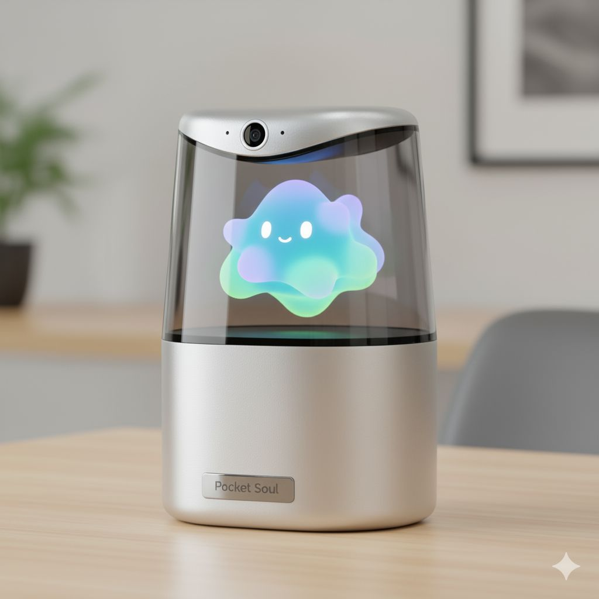

# 🔮 Pocket Soul - Holographic AI Companion



[](https://opensource.org/licenses/MIT)
[](https://nodejs.org/)
[](https://www.python.org/)

> A $3 holographic AI companion that brings emotional AI conversations to life through real-time video streaming and voice synthesis.

## ✨ What is Pocket Soul?

Pocket Soul transforms any smartphone into a **holographic AI companion** that can see, hear, speak, and express emotions through dynamic character animations. Using cutting-edge AI services, it creates an immersive conversational experience with:

> **Example Character**: See [`assets/sad_character.mp4`](assets/sad_character.mp4) for reference character format and styling.


- 🎤 **Real-time voice conversations** (Whisper + Gemini + ElevenLabs)
- 🎬 **Emotion-based video streaming** with character animations
- 📱 **Holographic display** optimized for smartphone hologram projectors
- 👁️ **Computer vision** for gesture recognition and user presence detection
- ⚡ **Ultra-low latency** streaming for natural interactions

## 🎯 Features

### Core Capabilities
- **Voice Conversations**: Speech-to-text, AI responses, and text-to-speech in real-time
- **Emotional Intelligence**: AI detects conversation emotions and displays matching character animations
- **Holographic Display**: Mobile-optimized interface for 3D hologram projection
- **Computer Vision**: Face detection, gesture recognition, and environmental awareness
- **Multi-Platform**: Desktop control panel + mobile hologram display
- **Network Streaming**: QR code setup for seamless device connections

### Technical Features
- **WebSocket Communication**: Real-time bidirectional data streaming
- **Multiple Streaming Modes**: WebSocket, WebRTC support
- **Responsive Design**: Optimized for both desktop and mobile devices
- **Performance Monitoring**: Built-in metrics and latency tracking
- **Emotion Mapping**: Intelligent fallback system for missing emotions
- **Fullscreen Support**: Enhanced mobile experience with proper fullscreen handling

## 🏗️ Architecture

### System Components
```
┌─────────────────┐    ┌─────────────────┐    ┌─────────────────┐
│   Control Panel │    │  Main Server    │    │ Mobile Display  │
│    (Desktop)    │◄──►│  (WebSocket)    │◄──►│  (Hologram)     │
└─────────────────┘    └─────────────────┘    └─────────────────┘
                               │
                       ┌───────▼────────┐
                       │   AI Services   │
                       │ ┌─────────────┐ │
                       │ │   Gemini    │ │
                       │ │ ElevenLabs  │ │
                       │ │   Whisper   │ │
                       │ │   Vision    │ │
                       │ └─────────────┘ │
                       └────────────────┘
```

### AI Services Integration
- **Google Gemini 2.5 Flash**: Conversational AI and response generation
- **ElevenLabs**: High-quality text-to-speech synthesis
- **OpenAI Whisper**: Speech-to-text transcription
- **Computer Vision**: Real-time face and gesture detection

## 🚀 Quick Start

### Prerequisites
- **Node.js** 18+ 
- **Python** 3.8+
- API keys for Gemini, ElevenLabs, and OpenAI
- Smartphone hologram projector (optional, works on any phone)

### Installation

1. **Clone the repository**:
   ```bash
   git clone https://github.com/your-username/pocket-soul.git
   cd pocket-soul
   ```

2. **Install dependencies**:
   ```bash
   # Node.js dependencies
   npm install
   
   # Python dependencies (for computer vision)
   pip install -r requirements.txt
   ```

3. **Configure environment**:
   ```bash
   cp .env.example .env
   # Edit .env with your API keys
   ```

4. **Start the application**:
   ```bash
   # Full system (recommended)
   ./start.sh
   
   # Or individual components
   npm start                    # Main server
   cd integrated_app && npm start  # Integrated app only
   python vision_service.py    # Computer vision service
   ```

### Environment Variables

Copy `.env.example` to `.env` and configure:

```env
# Required API Keys
GEMINI_API_KEY=your_gemini_api_key_here
ELEVENLABS_API_KEY=your_elevenlabs_api_key_here  
OPENAI_API_KEY=your_openai_api_key_here

# Optional Configuration
PORT=3000
INTEGRATED_PORT=4000
NGROK_AUTH_TOKEN=your_ngrok_token_for_tunneling
```

## 📱 Usage

### 1. Desktop Control Panel
- Open `http://localhost:3000` in your browser
- Use voice recording or text input to chat with the AI
- Monitor real-time metrics and connection status
- View available emotions and video content

### 2. Mobile Hologram Display
- Scan the QR code displayed on the control panel
- Or navigate to `http://your-ip:3000/hologram` on your phone
- Place phone in hologram projector for 3D effect
- The display automatically shows character animations based on conversation emotions

### 3. Computer Vision (Optional)
The vision service adds environmental awareness:
- **Face Detection**: Responds when users are present
- **Gesture Recognition**: Basic hand gesture understanding
- **Contextual AI**: AI responses can consider visual context

## 🎬 Character Animation System

### How It Works
1. **AI Conversation**: User speaks or types to the AI
2. **Emotion Detection**: System analyzes AI response for emotional content
3. **Video Selection**: Maps detected emotions to appropriate character videos
4. **Synchronized Playback**: Displays video with audio on hologram device

### Supported Emotions
- **Primary**: happiness, sadness, anger, fear, surprise, calm, excitement
- **Fallback System**: Automatically uses related emotions when specific ones aren't available
- **Extensible**: Easy to add new emotions and character variations

### Adding Custom Characters
1. Create MP4 videos with emotion-based naming: `{emotion}_character_{timestamp}.mp4`
2. Place in `generated_files/` directory
3. Restart server to auto-detect new content
4. Videos automatically become available for streaming

> **Example Character**: See [`assets/sad_character.mp4`](assets/sad_character.mp4) for reference character format and styling.

## 🛠️ Development

### Project Structure
```
pocket-soul/
├── integrated_app/          # Main integrated application
│   ├── server.js           # Unified server with audio + video
│   ├── lib/                # Emotion mapping, streaming logic
│   └── public/             # Control panel + mobile UI
├── lib/                    # Core business logic
│   ├── mood-pipeline.js    # Emotion detection
│   ├── voice-sync.js       # Audio generation
│   └── stream-manager.js   # Video streaming
├── api/                    # REST API endpoints
├── public/                 # Main web interface
├── vision_service.py       # Computer vision service
└── electron-main.js        # Desktop app (optional)
```

### Key Technologies
- **Backend**: Node.js, Express, Socket.IO
- **Frontend**: Vanilla JS, WebSocket, WebRTC
- **Computer Vision**: Python, OpenCV
- **Desktop App**: Electron (optional)
- **AI Services**: REST APIs + WebSocket streaming

### Development Commands
```bash
# Development mode with auto-reload
npm run dev

# Run integrated app only  
cd integrated_app && npm run dev

# Start with ngrok tunneling
npm run stream:ngrok

# Electron desktop app
npm run electron-dev
```

## 🔌 API Reference

### WebSocket Events
```javascript
// Client → Server
socket.emit('identify', 'hologram');           // Identify client type
socket.emit('audio-for-transcription', data);  // Send audio data
socket.emit('text-input', { text: 'Hello' });  // Send text message

// Server → Client  
socket.on('conversation-complete', callback);   // Full conversation result
socket.on('display-content', callback);        // Content for hologram
socket.on('status', callback);                 // Processing status updates
```

### REST Endpoints
```bash
GET  /api/health              # Service health check
GET  /api/connection          # Connection info + QR codes
POST /api/audio/process       # Process audio input
POST /api/generate            # Generate AI response
GET  /api/videos/:emotion     # Get video for emotion
```

## 📊 Performance & Monitoring

### Built-in Metrics
- **Response Times**: Transcription, AI generation, audio synthesis
- **Connection Status**: Active clients, connection quality
- **Content Statistics**: Available emotions, video counts
- **Network Performance**: Latency, bandwidth usage

### Optimization Tips
- Use local network (avoid internet routing) for best latency
- Ensure stable WiFi connection between devices
- Close unnecessary apps on mobile device
- Use hardware acceleration when available

## 🤝 Contributing

We welcome contributions! Here's how to get started:

1. **Fork the repository**
2. **Create a feature branch**: `git checkout -b feature/amazing-feature`
3. **Make your changes** and add tests if applicable
4. **Commit your changes**: `git commit -m 'Add amazing feature'`
5. **Push to the branch**: `git push origin feature/amazing-feature`
6. **Open a Pull Request**

### Development Guidelines
- Follow existing code style and conventions
- Add comments for complex logic
- Test on multiple devices when possible
- Update documentation for new features

## 📄 License

This project is licensed under the MIT License - see the [LICENSE](LICENSE) file for details.

## 🙏 Acknowledgments

- **AI Services**: Google Gemini, ElevenLabs, OpenAI
- **Hologram Community**: For inspiration and 3D projection techniques
- **Open Source Contributors**: Thank you for making this project better

## 🆘 Support & Community

- **Issues**: [GitHub Issues](https://github.com/your-username/pocket-soul/issues)
- **Discussions**: [GitHub Discussions](https://github.com/your-username/pocket-soul/discussions)
- **Discord**: Join our community server (link coming soon)

---

**Made with ❤️ for the future of human-AI interaction**

*Transform your smartphone into a holographic AI companion - because the future is now!*